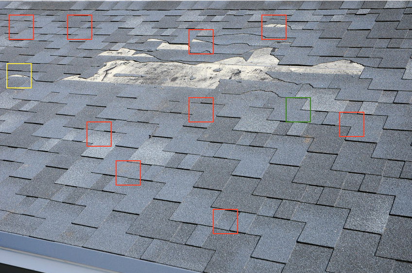

# canvas-rendering-react

- Clone the repo
- Go to cloned directory
- Run `npm i` to install dependecies
- Run `npm run dev` to serve the app on `http://localhost:3000`

The whole code is inside `pages/index.js`

### Sample Canvas with Image and Reactangle on it

